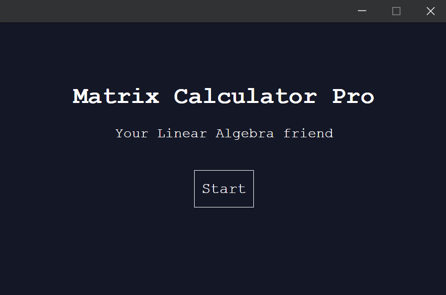

# Matrix-Calculator-
This is a new version of the matrix calculator application. Previous version was developed in Java and JavaFX ([click here](https://github.com/JackyXu-Cool/Matrix-Calculator)). Now, I rebuild the app with Electron, making this app work in multiple platform.

## Problems it could solve now
- [x] Matrix addition and subtraction
- [x] Matrix multiplication
- [x] Get the Row Echelon Form and Reduced Row Echelon Form from a given matrix
- [x] Matrix solving, Ax = b  
- [x] Determinant
- [x] Markov Matrix ( which will be a subclass of Matrix.java, inheriting all of its basic method and has its own unique methods)
- [x] The inverse of of a given matrix
- [x] Eigenvalues of a matrix ( 2 by 2 only )

## Usage 
Still in development. 

